# Hodgkin's Razor: a mechanistic digital twin for neural organ-on-chip recordings

**AI4S Open Innovation: AI for Life Science**, 5th Pazhou Algorithm Competition
**Category: End-to-End System**
Marc Donovici · Apache-2.0 · `github.com/Marc-Dvci/Hodgkin-s-Razor`
Pre-registrations: v1 `c40708bb19668164` (Tampere), v2 `5dc7a927085f8e46` (Dynasore, chips), v3 `2e1e630e6bffbecf` (chronic APV)

---

## Summary

A microelectrode array under a neural organ-on-chip records every network burst
of a living culture. Standard analysis turns that into a description: firing
fell, bursts shortened, synchrony dropped. It does not say which molecular
mechanism a compound moved. Blocking AMPA receptors, opening chloride channels
and shutting sodium channels can all look the same in a rate plot.

Hodgkin's Razor fits a biophysical network model to the recording itself. From
a baseline and a treated recording it returns the probability that each of ten
mechanisms moved, the size of the shift if it did, and an interval. When no
fitted model can reproduce the recording, it says so and names nothing. It is
trained only on simulations from a GPU network simulator and has never seen a
compound label.

Every result is scored the same way on untreated recordings: two stretches of
one well before any drug, sister cultures neither of which was treated, and
vehicle wells. A method's chance level is its own hit rate when nothing was
applied. That rule exposed a comparator whose 8/10 blind score was a fixed
preference: it named the same mechanisms on 6 of 10 untreated pairs.

**Blind test, version 3.** Charlesworth et al. (2015) plated mouse hippocampal cultures on sister arrays and kept an NMDA-receptor antagonist on one sister for days. The twin's probability that NMDA moved separates the 29 treated preparations from 23 untreated preparations of the same genotypes with an AUROC of **0.86** (95% CI 0.74 to 0.96), against a pre-registered bar of 0.70. On the same preparations, the published estimator of Doorn et al. scores 0.49, and the same twin with its pairing removed scores 0.66. The cultures compensate as they mature, as the original authors report. The twin's reading of NMDA fades with them (one-sided Wilcoxon p = 3e-05). The co-primary, NMDA as the single most probable mechanism, was not met (2/29 against 1/23), and no preparation's probability reached 0.5. The twin ranks the treated cultures above the untreated ones, but is not confident about any one of them.

**Blind test, version 2.** On human iPSC networks from another laboratory treated with Dynasore (Doorn et al. 2024), the twin failed its primary: it named the accepted mechanism in 2 of 10 wells, against a bar of 5. It detected the drug in 9 of 10 wells and in 0 of 10 untreated pairs of the same wells. It placed it in the right mechanism class in 8 of 10 (p = 0.0016).

The same simulator runs a two-compartment chip with directional microchannels,
the geometry of the supporting organisation. It computes, before an experiment
is run, which readout can resolve which property of a device and how many chips
a claim needs. For directional channels it gives the number of chips a claim needs: about 20 per design. The one public test available had about 8, which gives power 0.48. It also reproduces part of the sponsor laboratory's cortico-striatal result. The first committed prediction failed. The revision imposed only the paper's own statement that an isolated striatum is silent, and it moved both synchrony readouts in the published direction (p = 0.002 and 0.008). Calcium-event frequency did not follow.

Everything runs from public data on one desktop GPU. The demo, the web
application and the notebook run on a CPU.

---

## 1. The problem

Organ-on-chip platforms exist to replace animal experiments in neurotoxicity
and neuropharmacology. Extracellular electrophysiology is the readout that
carries the most information per unit cost: a multi-well array records network
activity non-invasively for weeks. The analysis stops at description. Published
pipelines report firing rate, burst rate and duration, the fraction of spikes
in bursts and pairwise synchrony. Those are the right numbers, but they do not
answer the question an experiment is run to answer.

Mechanism matters downstream. In safety pharmacology, a compound that silences
a network by blocking sodium channels carries a different liability from one
that potentiates inhibition. In disease modelling, a patient line that is quiet
because of reduced excitatory conductance points somewhere different from one
that is quiet because of raised adaptation. The supporting organisation of this
challenge, CellShells, states the goal directly: AI-driven organ-on-chip
digital twins built on neural chip data, moving the field from experimental
description toward predictive simulation. This project is that step, for the
two questions a laboratory asks: what did the compound do, and what should be
measured next.

## 2. What the system is

An end-to-end system from a recording to a decision (Figure 1):

1. **Input.** Two spike tables: one well before and after wash-on, or two
   sister cultures. Any array works (Axion, Multi Channel Systems, or a
   two-column CSV).
2. **Recording system.** The array's electrode layout and detection dead time
   are applied identically to the recording and to every simulation.
3. **Statistics.** Forty summary statistics, computed by one function for
   recorded and simulated events alike.
4. **Posterior.** Five presence heads give the probability that each mechanism
   moved. A conditional normalising flow gives the culture's parameters, and the
   size of each shift given that it moved.
5. **Guard.** Two tests: typicality (does any simulation resemble this pair?)
   and a predictive check (does the twin, re-simulated at the posterior,
   reproduce it?). If either fires, no mechanism is named.
6. **Report.** The called mechanisms with direction, effect and interval; the
   mechanism class; the rivals the recording cannot separate; the culture's
   parameters; and a content hash. Available as JSON, Markdown, a web page or
   a notebook cell.
7. **Next experiment.** When two mechanisms tie, the tool compound that best
   separates them. For a chip, which readout resolves which property, and how
   many chips a claim needs.

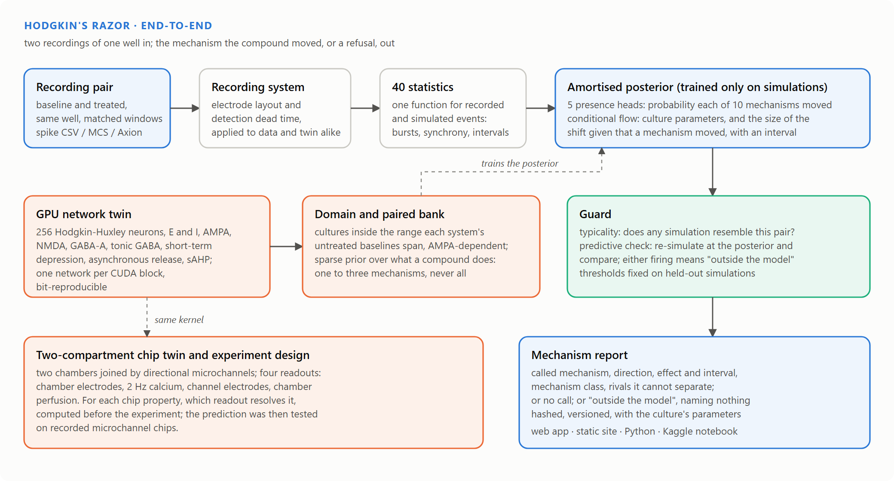

## 3. Related work and what is new

Simulation-based inference has been applied to MEA recordings once, and well.
Doorn, van Putten and Frega (*Communications Biology*, 2025) trained a masked
autoregressive flow on 300,000 simulations of a 100-neuron Hodgkin-Huxley
network, and recovered ten parameters of human iPSC-derived networks. Their
code and trained estimator are public, and both are used here. Their simulator
is the starting point of this one, and their estimator is scored beside it on
every test.

| Their stated limitation | Here |
|---|---|
| Excitatory neurons only, so GABAergic compounds are out of reach | an inhibitory population, synaptic and tonic GABA-A; gabazine and GABA are scored |
| Posteriors comparable only within one MEA experiment | the shift is inferred within a well or between sister cultures, from a paired design with a calibrated nuisance drift |
| Misspecification noted, not handled | a guard with two tests that refuses to name a mechanism, its thresholds fixed on held-out simulations |
| One population, no device geometry | a two-compartment chip twin with directional channels, four readouts and a striatal target |
| One recording system | recording systems as explicit views; one twin per system, trained on the domain its own untreated baselines span |

What is new in method, beyond the table:

* **Null-pair scoring.** Every test pairs treated recordings with untreated
  pairs read the same way, and a method's chance is its hit rate on those. A
  ranking of mechanisms by shift size can land on an answer key by preference
  alone. Section 7.2 shows it happening to a comparator built from this twin.
* **Pre-registration enforced in code.** The readers refuse to return a blind
  recording until the pre-registration exists and matches its hash. The
  evaluation refuses to run if any frozen model changed. A stop rule, committed
  before training, forbids freezing a test the twin fails on its own
  simulations.

Other entries to this challenge that work on neural MEA data describe
recordings (quality control, feature fingerprints, forecasts). None infers a
mechanism with a model that can be re-simulated.

## 4. Data

| Dataset | What it is | Role | Licence |
|---|---|---|---|
| Charlesworth et al., *Neuropharmacology* 2015 | mouse hippocampal cultures on sister MCS 60-electrode arrays, recorded from 6 to 30 days; chronic 50 uM APV on one sister from day 7; wild type and eight knockout lines | **blind test** of version 3 | CC0 1.0 |
| Doorn et al., *Stem Cell Rep.* 2024 | human iPSC Ngn2 neurons with rat astrocytes, 10 uM Dynasore, 10 wells; MCS 24-well, 12 electrodes | **blind test** of version 2 | Apache-2.0 repository |
| Mateus et al., bioRxiv 2024 | rat hippocampal neurons in two-compartment chips with straight, Tesla, Tesla v2, Rams and Arrows microchannels; MCS 256-electrode | **blind test** of the chip readout prediction | CC BY-NC-ND (research use; read in place, not redistributed) |
| Tampere comparative MEA (Hyvärinen et al., *Sci Data* 2022) | rat cortical DIV 22 and hPSC-derived DIV 29 plates; CNQX, D-AP5, GABA, gabazine, kainic acid, TTX, vehicle; 16 electrodes | development set (scored in version 1) | CC BY 4.0 |
| Doorn et al., *Commun Biol* 2025 | trained estimator and feature code | prior art, scored beside the twin | Apache-2.0 |
| Lassus et al., *Sci Rep* 2018 | published directions of NMDA (GluN2B) block in cortico-striatal chips | a reproduction target for the chip twin | cited, no data used |

No restricted, clinical or personal data is used. Every file the results depend
on is checked against its SHA-256 by `scripts/fetch_tampere.py` and
`scripts/fetch_external.py`. Details in `docs/DATA.md`.

## 5. The model

### 5.1 The network

256 conductance-based neurons on a 16 x 16 grid at 45 um. Each has Traub-Miles
sodium and potassium currents, a slow calcium-dependent after-hyperpolarisation
and membrane noise. A fraction of neurons is inhibitory. Synapses are AMPA,
NMDA with its magnesium block, and GABA-A; bath-applied GABA acts through a
tonic GABA-A conductance on every cell. Every terminal carries short-term
depression. After Doorn et al., it also carries asynchronous release: each
spike raises a release rate that decays over 700 ms, and each asynchronous
release transmits and depletes the vesicle pool without a somatic spike.
Conduction delays scale with distance.

Sixteen parameters, ten of which a compound may move:

| Parameter | Range | Scale | Compound may move it |
|---|---|---|---|
| `noise` (Membrane noise) | 1.5 to 7 | linear | no, held fixed across a pair |
| `g_na` (Na conductance) | 0.08 to 2 | log | yes |
| `g_kdr` (Kdr conductance) | 0.3 to 4 | log | yes |
| `g_ahp` (Slow AHP conductance) | 0.5 to 10 | log | yes |
| `g_ampa` (AMPA conductance) | 0.004 to 1.2 | log | yes |
| `g_nmda` (NMDA conductance) | 0.0004 to 0.12 | log | yes |
| `g_gaba` (Synaptic GABA-A conductance) | 0.004 to 8 | log | yes |
| `g_tonic_inh` (Tonic GABA-A conductance) | 0.001 to 0.5 | log | yes |
| `p_conn` (Connection probability) | 0.1 to 0.6 | linear | no, held fixed across a pair |
| `f_inh` (Inhibitory fraction) | 0.05 to 0.4 | linear | no, held fixed across a pair |
| `tau_d` (Vesicle recovery time) | 150 to 1200 | log | yes |
| `u_rel` (Release fraction per spike) | 0.02 to 0.6 | log | yes |
| `i_drive` (Tonic drive) | 0 to 22 | linear | yes |
| `p_detect` (Event detection fraction) | 0.02 to 1 | log | no, held fixed across a pair |
| `elec_het` (Electrode pickup spread) | 0.01 to 1.6 | linear | no, held fixed across a pair |
| `u_asyn` (Asynchronous release strength) | 0 to 0.005 | linear | no, held fixed across a pair |

### 5.2 Implementation

One CUDA block simulates one network and one thread simulates one neuron, with
the whole time loop in shared memory. Spiking neurons are collected with a warp
ballot and read back in neuron order, so floating-point sums never reorder and a
run is bit-reproducible (`test_simulator_is_deterministic`). On one RTX 4070,
the kernel simulates about 151 networks of 65 simulated seconds per
second.

### 5.3 Recording systems

A real array reports what its electrodes see after its own detection. The
kernel records every electrode at 0.2 ms. Each recording system is a view that
applies its electrode layout and dead time to recorded and simulated events
alike:
- the Axion 48-well plate of the Tampere data (16 electrodes, 2 ms);
- the MCS 24-well plate of the Doorn data (a 4 x 4 grid whose four corners are
  reference electrodes, 0.3 ms);
- the MCS 60-electrode array of the Charlesworth data, read as four 4 x 4
  quadrants on the same 12-electrode layout, 1.08 ms.

Each dead time is the shortest interval in that system's own recordings.

### 5.4 The domain each twin covers

Most of the prior produces cultures that are silent, saturated or driven by
membrane noise, in which blocking a synapse changes nothing. Each recording
system's domain is read from its own untreated baselines:
- the 2nd to 98th percentile of eight detection-robust statistics, widened;
- a living, network-driven culture;
- the pharmacological definition of a cortical culture: blocking AMPA
  collapses its activity below 35 percent.

A population search, then a nearest-neighbour step, finds where the simulator
produces that domain. No treated recording and no compound label enters it
(Figure 2).

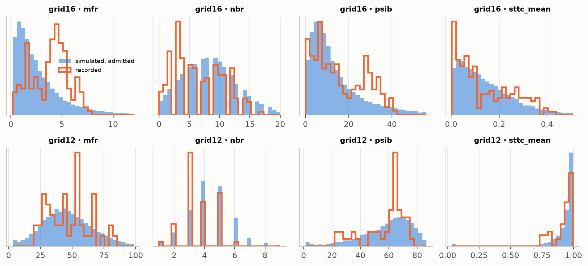

### 5.5 The sparse prior over what a compound does

A compound moves one to three mechanisms, rarely all. For each shiftable
parameter, the prior has a narrow component near zero and, for a small active
set, a wide component: fold changes from 1.5 to 25 for conductances, and
log-uniform magnitudes for the linear parameters. The direction of each active
shift is drawn among the directions the baseline leaves room for. A shift that
the prior bounds would clip away is labelled inactive.

### 5.6 Two designs: one well twice, or two sisters

**Within a well** (versions 1 and 2), the baseline and treated recordings share
wiring and electrode pickup, so the simulator holds both fixed across a pair.

**Between sisters** (version 3), a preparation is plated on two arrays and
only one receives the compound. Sisters are the same preparation, not the same
network. The bank simulates the second sister with its own wiring and pickup,
and nudges every culture parameter by a drift that is never labelled as a
mechanism. The drift's size is set so that simulated sister differences match
recorded untreated sister pairs. It came out at 0.12 of each parameter's
range at 6–7 days, and again at 10–14 days on sister pairs that were never
treated.

### 5.7 Inference

The bank holds 240 000 within-well and 288 000 sister simulated pairs. Five presence heads read both
recordings and their difference, and give the probability each mechanism
moved; they are averaged and calibrated on held-out cultures. A masked
autoregressive flow, conditioned on the recordings and on the active set, gives
the culture's parameters and the shift. Sampling the active set from the
presence probabilities gives the joint posterior. Fixing it to one mechanism
gives the effect of that mechanism, if it is the one that moved. Training,
validation and calibration are split by simulated culture.

### 5.8 The guard

A posterior is worth reading only if the twin can produce the recording.
- **Typicality** is the mean distance of the pair, in the twin's standardised
  statistics, to its ten nearest training simulations.
- **The predictive check** re-simulates 48 posterior draws and counts the
  statistics that fall outside their predictive band.

Each threshold is the 97.5th percentile over held-out simulations, where the
model is right by construction. Either test firing means the recording is
outside the model, and no mechanism is named.

## 6. How it was evaluated, and what was scored more than once

There were three pre-registrations, each hashed before the model it covers saw
its blind data. The code enforces the order: the Doorn and Charlesworth readers
refuse to return a blind recording, and the evaluations refuse to run, unless
the pre-registration matches its recorded hash and every frozen model matches
the digest it lists.

* **Version 1** fixed the Tampere answer key. The pre-registered model reached
  0.091, which is chance. Three corrections, driven by label-free checks,
  followed, and Tampere was scored four times in version 1. It is therefore a
  development set, and no blind claim rests on it.
* **Version 2** was scored on Dynasore wells from another laboratory and on
  recorded chips (sections 7.2 and 7.4). Its primary failed.
* **Version 3** was built on what version 2 diagnosed (section 7.1). Its null
  group is matched on genotype. A stop rule, committed before the version 3 twin
  was trained, required the twin to pass the test on its own simulations before
  the pre-registration could be hashed.

The stop rule required an AUROC of at least 0.80 on simulated sister pairs with NMDA blocked alone, and 0.70 with a second mechanism moving. The first twin missed the first bar. A second simulation bank was added and the twin retrained. The bars did not move:

| Attempt | Twin digest | `g_nmda` alone (bar 0.80) | With a co-shift (bar 0.70) | Passed |
|---|---|---|---|---|
| 1 | `c4096c60149d` | 0.792 | 0.747 | no |
| 2 | `a4f079b64bb4` | 0.810 | 0.755 | yes |

## 7. Results

### 7.1 Blind test, version 3: chronic NMDA blockade on sister cultures

Charlesworth et al. plated each preparation on two sister arrays and added the
NMDA antagonist APV to one of them after day 7. The twin reads the untreated
sister as the baseline and the treated sister as the treated recording. The
same reading is applied to preparations where neither sister was treated. The
answer key is `g_nmda`, direction down. The primary is the AUROC of the
presence probability of `g_nmda`, treated preparations against untreated
preparations of the same genotypes, over 10 to 14 days in vitro.

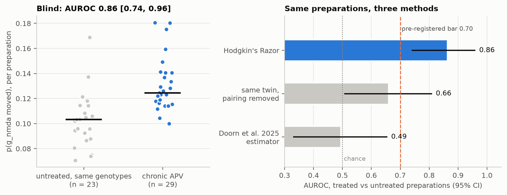

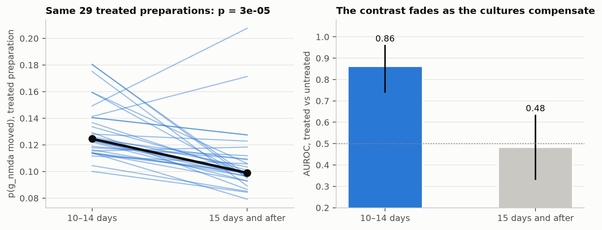

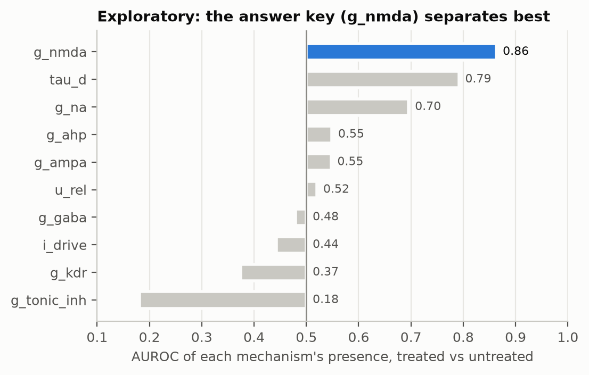

| Pre-registered outcome | Bar | Result | Outcome |
|---|---|---|---|
| **Primary**: AUROC of p(`g_nmda`), treated against genotype-matched null preparations, 10–14 days | ≥ 0.70, lower 95% bound > 0.50 | **0.864** [0.74, 0.96] | **met** |
| **Co-primary**: share with `g_nmda` top-1, treated against null | higher, one-sided Fisher p < 0.05 | 2/29 against 1/23, p = 0.59 | **not met** |

| Contrast | Treated / null preparations | AUROC of p(`g_nmda`) [95% CI] | Top-1 `g_nmda` | Median p(`g_nmda`) | Detection AUROC |
|---|---|---|---|---|---|
| Primary ages, genotype-matched null | 29 / 23 | **0.86** [0.74, 0.96] | 2/29 vs 1/23 (p 0.59) | 0.12 vs 0.10 | 0.62 |
| Primary ages, pooled null (all genotypes) | 29 / 78 | **0.79** [0.70, 0.87] | 2/29 vs 4/78 (p 0.52) | 0.12 vs 0.10 | 0.60 |
| Primary ages, GluR1 only | 13 / 6 | **0.71** [0.45, 0.92] | 1/13 vs 0/6 (p 0.68) | 0.12 vs 0.11 | 0.85 |
| Primary ages, WT only | 16 / 17 | **0.92** [0.78, 1.00] | 1/16 vs 1/17 (p 0.74) | 0.14 vs 0.10 | 0.53 |
| Late (15 days and after), genotype-matched null | 44 / 24 | **0.48** [0.33, 0.63] | 1/44 vs 0/24 (p 0.65) | 0.10 vs 0.10 | 0.50 |
| Late, pooled null | 44 / 79 | **0.49** [0.38, 0.60] | 1/44 vs 0/79 (p 0.36) | 0.10 vs 0.10 | 0.63 |

**Canalization** (pre-registered secondary): in the 29 treated preparations recorded at both ages, the median presence of `g_nmda` is 0.125 at 10–14 days and 0.099 at 15 days and after; one-sided Wilcoxon signed-rank p = 3e-05.

Calls above 0.5: 0.00 of treated and 0.00 of null preparations. The twin ranks treated preparations above untreated ones on `g_nmda`, but no preparation's presence probability reaches 0.5: the reading is a ranking against untreated sisters, not a call on one culture.
Direction among top-1 hits: 1.00 down (2 preparations).
Windows scored: 14607.

**Exploratory: every mechanism, treated against matched null** (no bar). AUROC of each mechanism's presence probability:

| Mechanism | AUROC | Median treated | Median null |
|---|---|---|---|
| `g_nmda` | 0.86 | 0.125 | 0.103 |
| `tau_d` | 0.79 | 0.127 | 0.089 |
| `g_na` | 0.70 | 0.095 | 0.087 |
| `g_ahp` | 0.55 | 0.108 | 0.093 |
| `g_ampa` | 0.55 | 0.052 | 0.045 |
| `u_rel` | 0.52 | 0.095 | 0.097 |
| `g_gaba` | 0.48 | 0.136 | 0.136 |
| `i_drive` | 0.44 | 0.129 | 0.132 |
| `g_kdr` | 0.37 | 0.148 | 0.152 |
| `g_tonic_inh` | 0.18 | 0.123 | 0.132 |

The top-1 counts show why the co-primary failed while the primary passed: the most probable mechanism is usually another one in both groups, and `g_nmda` rises relative to untreated preparations without becoming the largest.

| Group | Top-1 counts |
|---|---|
| Treated | `g_gaba` 10, `g_kdr` 7, `tau_d` 7, `g_na` 2, `g_nmda` 2, `g_ampa` 1 |
| Null | `g_kdr` 13, `g_gaba` 5, `u_rel` 2, `tau_d` 1, `g_nmda` 1, `g_ahp` 1 |

**Comparators on the same preparations.**

| Contrast | Treated / null preparations | AUROC of p(`g_nmda`) [95% CI] | Top-1 `g_nmda` | Median p(`g_nmda`) | Detection AUROC |
|---|---|---|---|---|---|
| Hodgkin's Razor (paired twin) | 29 / 23 | **0.86** [0.74, 0.96] | 2/29 vs 1/23 (p 0.59) | 0.12 vs 0.10 | 0.62 |
| Same twin, pairing removed (unpaired) | 29 / 23 | **0.66** [0.51, 0.81] | 1/29 vs 5/23 (p 1) | 0.31 vs 0.26 | 0.72 |
| Doorn et al. 2025 estimator (score: standardised g_NMDA shift, downward) | 29 / 23 | **0.49** [0.33, 0.65] | 2/29 vs 5/23 (p 0.98) | -0.10 vs -0.01 | 0.54 |

For the unpaired twin and the Doorn estimator, the "median p" column is their own score, not a probability.

**The guard on this test.**

| Test | Bar | Fire rate | Outcome |
|---|---|---|---|
| Held-out simulated sister pairs | ≤ 0.10 | 0.02 (n 60) | met |
| Simulated pairs with unmodelled receptor kinetics | ≥ 0.80 | 0.58 (n 60) | not met |
| Recorded pairs, electrodes circularly shifted | ≥ 0.80 | 0.63 (n 60) | not met |

On the recorded windows it fires on 0.35 of treated and 0.46 of null windows.
Preparations outside the model (most windows fire): 37 of 107.
Primary contrast restricted to preparations the guard passes: AUROC 0.89 [0.75, 0.98] (24 treated, 16 null).

The guard's two must-fire bars were not met on sister pairs, where the second recording differs from the first in wiring and pickup as well as in the compound. Its version 2 counterpart on the MCS 24-well plate met all three (section 7.6). The primary does not depend on the guard. Restricted to the preparations the guard passes, the contrast is the one reported above the table.

### 7.2 Blind test, version 2: Dynasore on human iPSC networks

Dynasore inhibits dynamin, slows vesicle recycling and strengthens short-term
depression; Doorn et al. model it as an increase of the depression parameter U.
Both `u_rel` (U) and `tau_d` (vesicle recovery) are accepted, direction up.

| Quantity | Value |
|---|---|
| Wells scored | 10 |
| Top-1 (u_rel or tau_d) | **2/10 = 0.20**, 95% CI 0.06 to 0.51 |
| Chance | 0.20 |
| P under chance | 0.62 |
| Pre-registered success | at least 5 of 10: **not met** |
| Mechanism class (adaptation and short-term plasticity) | 0.80 (chance 0.30) |
| Top-2 | 0.40 |
| Direction up, among correct calls | 1.00 (2 wells) |
| Wells with a call above 0.5 | 0.90 |

Per well: the named mechanism, its probability, and the effect if it moved.

| Well | Top-1 | p | Effect of top-1 (transformed units) | u_rel p | tau_d p | Guard |
|---|---|---|---|---|---|---|
| FB2_B6 | `g_ampa` | 0.94 | +0.63 [+0.14, +1.11] | 0.43 | 0.32 | outside |
| FB2_C6 | `tau_d` | 0.71 | +1.38 [+1.13, +1.57] | 0.10 | 0.71 | outside |
| FB2_D6 | `g_ahp` | 0.95 | +1.19 [+0.86, +1.55] | 0.16 | 0.26 | outside |
| FB2t_A2 | `tau_d` | 0.92 | +1.54 [+1.26, +1.74] | 0.08 | 0.92 | outside |
| FB2t_A3 | `g_ahp` | 0.93 | +0.08 [+0.01, +0.48] | 0.57 | 0.24 | inside |
| FB2t_B1 | `g_ahp` | 0.83 | +0.55 [+0.26, +0.86] | 0.74 | 0.23 | inside |
| FB2t_C1 | `g_ahp` | 0.96 | +0.54 [+0.16, +0.91] | 0.48 | 0.29 | outside |
| FB3t_A3 | `g_ahp` | 0.96 | +1.13 [+0.74, +1.50] | 0.05 | 0.02 | outside |
| FB3t_C3 | `g_ahp` | 0.80 | +0.65 [+0.21, +1.21] | 0.04 | 0.32 | inside |
| FB3t_D1 | `g_gaba` | 0.41 | +1.43 [+0.33, +3.36] | 0.09 | 0.04 | outside |

| Method | Top-1 |
|---|---|
| Hodgkin's Razor | 0.20 |
| Same twin, pairing removed | 0.80 |
| Doorn et al. 2025 estimator (U or tau_D accepted) | 0.80 |
| Hodgkin's Razor, wells the guard passes (3) | 0.00 |


**The same wells read with null pairs (post hoc).** Two pre-drug stretches of each well, 4 minutes apart, are read exactly as a drug pair. For a method with a preference, chance is its own hit rate here, not one in ten:

| Method | Dynasore pairs: top-1 in {`u_rel`, `tau_d`} | Pre-drug null pairs: same | Null pairs with a call |
|---|---|---|---|
| Hodgkin's Razor (paired twin) | 2/10 | 2/10 | 0/10 |
| Same twin, pairing removed | 8/10 | 6/10 | 1/10 |
| Doorn et al. estimator | 8/10 | 2/10 ignoring direction; 0/10 in the answer's direction (up) | - |

The unpaired comparator's 8/10 is a fixed preference, not a detection. The paired twin named nothing on any null pair and called the drug in 9 of 10 treated wells. This is why every version 3 result is scored against untreated pairs.

**Why the named member failed.** The version 2 bank assumed that nothing changes in a well between two recordings. Measured on untreated pairs, the no-compound drift is 0.03 of each parameter's range over 4 minutes (Doorn pre-drug pairs) and 0.04 across a wash-on (Tampere vehicle wells). With no drift, 0.23 of the recorded untreated differences fall outside the simulated 95% band, against about 0.05 once the drift is added. A twin that has never seen drift must explain every slow change as a compound. The version 3 design includes a calibrated drift from the start.

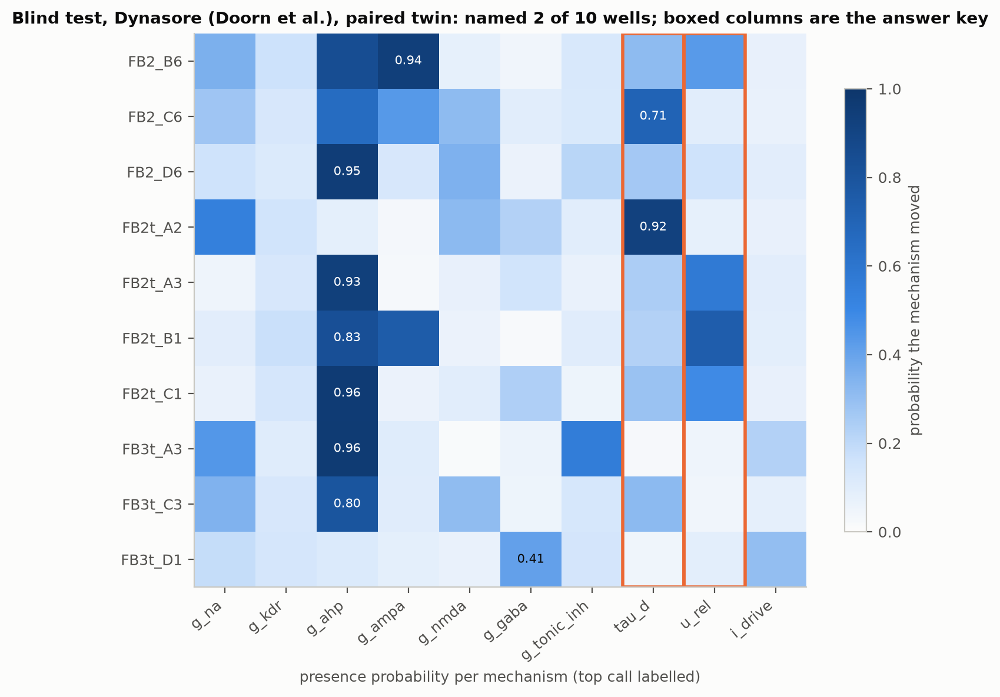

### 7.3 Development set: Tampere, fifth scoring

| Quantity | Version 1 key | Version 2 key |
|---|---|---|
| Top-1 | **0.24** (16/66) | **0.24** (16/66) |
| Chance | 0.10 | 0.12 |
| Top-2 | 0.35 | 0.35 |
| Mechanism class | 0.33 | 0.33 |
| Control false-mechanism rate (ceiling 0.20) | 0.00 | - |
| Treated wells with a call | 0.32 | - |
| Accuracy of those calls | 0.52 | 0.52 |
| Detection AUROC, treated against control | 0.89 | - |

| Compound | Wells | Top-1 (v1 key) | Rat | Human |
|---|---|---|---|---|
| CNQX | 11 | 4/11 | 4/7 | 0/4 |
| D-AP5 | 11 | 1/11 | 1/7 | 0/4 |
| GABA | 11 | 0/11 | 0/7 | 0/4 |
| Gabazine | 11 | 2/11 | 2/7 | 0/4 |
| Kainic acid | 11 | 5/11 | 5/7 | 0/4 |
| TTX | 11 | 4/11 | 4/7 | 0/4 |

| Method | Sees labels | Top-1 (v1 key) |
|---|---|---|
| Hodgkin's Razor v2 | no | 0.24 |
| Same twin, pairing removed | no | 0.09 |
| Doorn et al. 2025 estimator | no | 0.15 |
| Supervised nearest centroid, leave one well out | yes | 0.52 |

Wells the guard passes: 39; top-1 on them (v2 key) 0.39.


Bath GABA was read wrongly in every well. On simulations (section 7.7) this is an identifiability limit rather than a simulator error. Saturating bath GABA silences the culture, and a silenced culture carries no signature of what silenced it: the twin reads it as a sodium block in most simulations, as it does in the recorded rat wells.

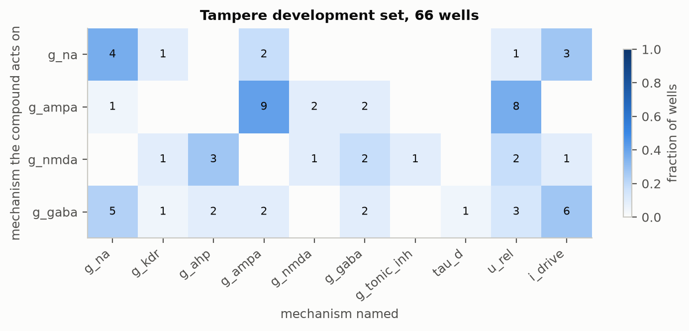

### 7.4 The chip readout prediction, on recorded microchannel chips

Simulated chips: recovery r and 90% interval coverage of each chip parameter, by readout (held-out chips).

| Readout | `p_cross` r (cov.) | `direction_sel` r (cov.) | `g_cross` r (cov.) | `tgt_autonomy` r (cov.) |
|---|---|---|---|---|
| compartment | 0.17 (0.93) | -0.01 (0.95) | 0.26 (0.91) | 0.39 (0.90) |
| calcium_2hz | 0.16 (0.89) | 0.02 (0.92) | 0.26 (0.90) | 0.33 (0.89) |
| channel | 0.59 (0.89) | 0.37 (0.88) | 0.03 (0.89) | 0.14 (0.89) |
| perfusion | 0.23 (0.88) | 0.11 (0.96) | 0.35 (0.90) | 0.40 (0.91) |
| compartment+channel | 0.73 (0.90) | 0.45 (0.91) | 0.28 (0.93) | 0.41 (0.92) |

Simulated AUROC, strong diode against symmetric channel: channel statistic 0.78, chamber statistic 0.52.

NMDA reduction on 191 source-driven chips: target calcium event frequency lower in 0.30, target synchrony lower in 0.32 of chips (Lassus et al.: both lower).

Recorded chips (Mateus et al. 2024), diode (Rams, Arrows) against straight channels:

| Statistic | AUROC | 95% CI (chips resampled) | Pre-registered | Outcome |
|---|---|---|---|---|
| Channel electrodes: dominant share of propagation | 0.62 | 0.28 to 0.88 | separates (>= 0.75) | **not met** |
| Chamber electrodes: cross-correlation asymmetry | 0.41 | 0.20 to 0.60 | does not separate (< 0.7) | **met** |

33 recordings from 17 chips scored.

| Design | Recordings | Median dominant share | Median chamber asymmetry |
|---|---|---|---|
| arrows | 13 | 0.84 | 0.16 |
| control | 15 | 0.73 | 0.21 |
| rams | 11 | 0.91 | 0.25 |
| tesla | 8 | 0.79 | 0.17 |
| tesla_v2 | 10 | 0.84 | 0.16 |


The channel statistic's interval spans 0.28 to 0.88. With about 8 chips per design, the test could not have told 0.75 from 0.5, so the outcome is inconclusive rather than negative. Section 8 turns this into the tool's first design output: how many chips the claim needs.

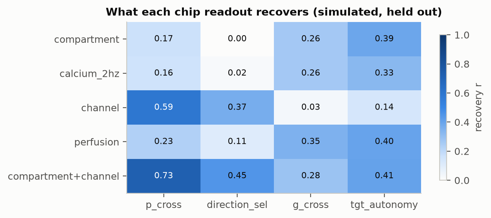

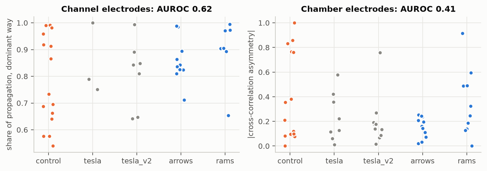

### 7.5 Simulations and calibration

**Version 3: sister pairs on the MCS 60-electrode array (quadrants).** Two sisters differ in wiring and electrode pickup, not only in the compound, so every number here is lower than for one well recorded twice.

| Held-out simulated sister pairs | n | Top-1 | Top-2 | Class |
|---|---|---|---|---|
| all single mechanism | 7858 | 0.31 | 0.45 | 0.45 |
| saturating | 1730 | 0.43 | 0.58 | 0.57 |

| Mechanism | Presence AUROC | 90% coverage | Effect r |
|---|---|---|---|
| `g_na` | 0.71 | 0.89 | 0.76 |
| `g_kdr` | 0.54 | 0.85 | 0.21 |
| `g_ahp` | 0.71 | 0.88 | 0.63 |
| `g_ampa` | 0.80 | 0.89 | 0.73 |
| `g_nmda` | 0.67 | 0.88 | 0.68 |
| `g_gaba` | 0.60 | 0.87 | 0.53 |
| `g_tonic_inh` | 0.58 | 0.87 | 0.44 |
| `tau_d` | 0.74 | 0.89 | 0.54 |
| `u_rel` | 0.72 | 0.89 | 0.74 |
| `i_drive` | 0.56 | 0.88 | 0.41 |

The version 2 twins (one well recorded twice) are in Appendix A.

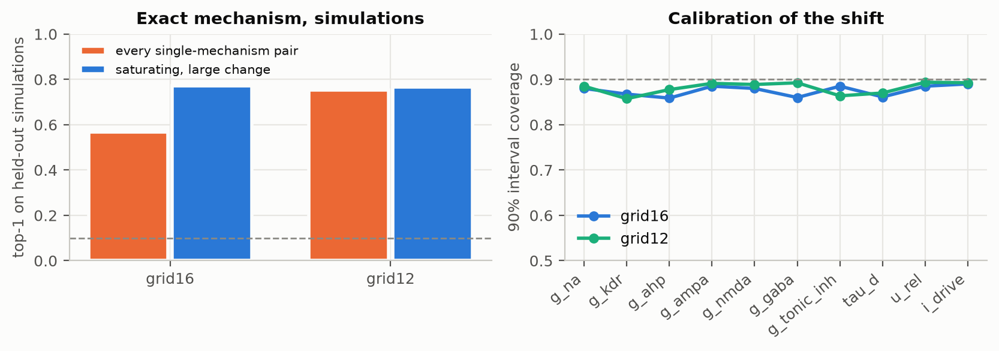

### 7.6 The guard

**Version 2, one well recorded twice** (full table in Appendix A). On the MCS 24-well plate the guard met all three bars: it fired on 0.02 of held-out simulations, 0.95 of simulations with unmodelled kinetics and 1.00 of shuffled recordings. On the Axion plate it missed both must-fire bars.

**Version 3, sister pairs.**

| Test | Bar | Fire rate | Outcome |
|---|---|---|---|
| Held-out simulated sister pairs | ≤ 0.10 | 0.02 (n 60) | met |
| Simulated pairs with unmodelled receptor kinetics | ≥ 0.80 | 0.58 (n 60) | not met |
| Recorded pairs, electrodes circularly shifted | ≥ 0.80 | 0.63 (n 60) | not met |

On the recorded windows it fires on 0.35 of treated and 0.46 of null windows.
Preparations outside the model (most windows fire): 37 of 107.
Primary contrast restricted to preparations the guard passes: AUROC 0.89 [0.75, 0.98] (24 treated, 16 null).

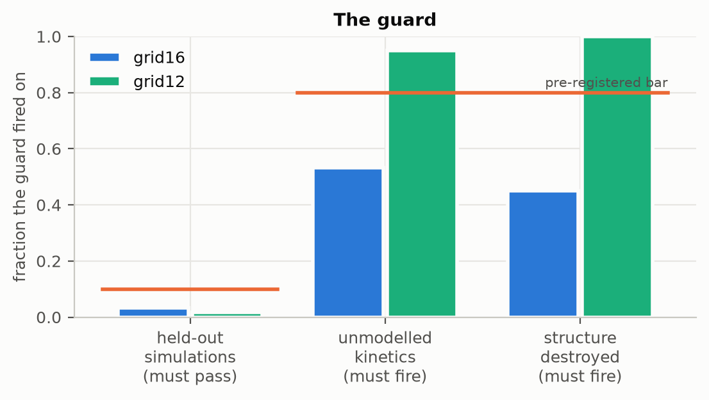

### 7.7 Does the twin reproduce known pharmacology?

A twin that cannot represent a compound cannot attribute a recording to it.
Saturating blocks and agonists are applied to cultures the bank admitted, and
the change in firing is compared with the published direction and rough size.

On cultures the banks admitted, 12 of 12 saturating blocks and agonists change firing in the published direction and rough size (full table in Appendix A).

**Bath GABA, read by the twin on simulations** (`scripts/gaba_check.py`):

| Simulated condition | Rate after / before | Top-1 correct | Top-1 `g_na` | Top-1 inhibition |
|---|---|---|---|---|
| bath GABA, tonic +0.01 | 0.86 | 0.15 | 0.00 | 0.19 |
| bath GABA, tonic +0.02 | 0.70 | 0.24 | 0.03 | 0.25 |
| bath GABA, tonic +0.04 | 0.39 | 0.19 | 0.23 | 0.21 |
| bath GABA, saturating (0.25) | 0.00 | 0.33 | 0.64 | 0.33 |
| synaptic GABA-A x3 | 0.66 | 0.41 | 0.01 | 0.44 |
| sodium block x0.4 | 0.14 | 0.59 | 0.59 | 0.08 |

As bath GABA rises towards saturation, the culture falls silent and the twin's reading moves from inhibition to the sodium channel. Both silence the culture, and nothing in a silent recording separates them. A partial concentration, or a follow-up with a GABA-A antagonist, would.

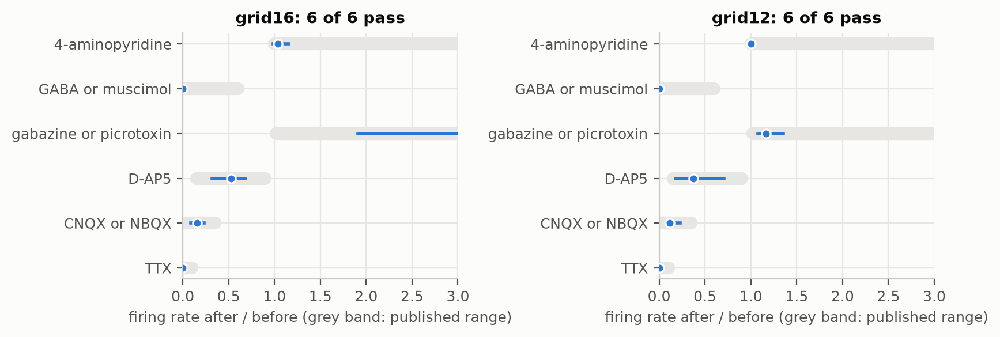

## 8. From description to predictive simulation: the planning tool

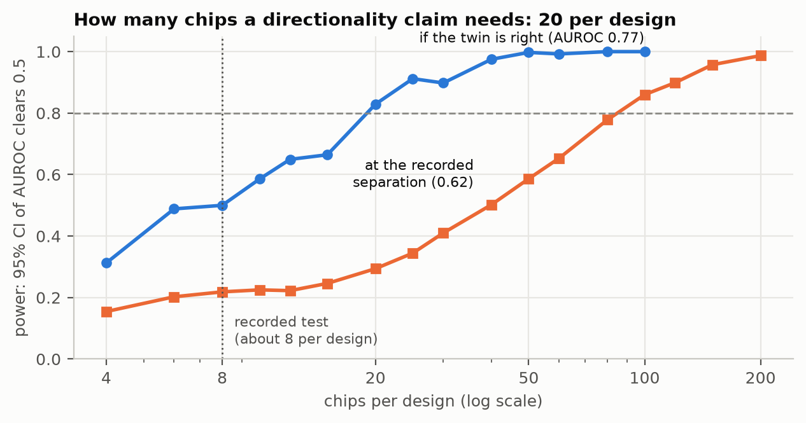

The sponsor's stated goal is to move neural organ-on-chip work from experimental description to predictive simulation. This section is that step: before any experiment is run, the twin says what to measure, how many chips to use, and which follow-up resolves an ambiguity.

**Which readout resolves which property of a chip** (simulations, held-out chips): channel electrodes recover direction selectivity; chamber electrodes and 2 Hz calcium do not (section 7.4, Figure 5). A laboratory that wants to show its diodes work should put electrodes in the channels.

**How many chips a claim needs** (`scripts/chip_power.py`):

| Chips per design | Power if the twin is right | Power at the recorded separation (0.62) |
|---|---|---|
| 6 | 0.49 | 0.20 |
| 8 | 0.50 | 0.22 |
| 10 | 0.59 | 0.23 |
| 15 | 0.66 | 0.25 |
| 20 | 0.83 | 0.29 |
| 30 | 0.90 | 0.41 |
| 50 | 1.00 | 0.59 |
| 100 | 1.00 | 0.86 |

Channel statistic, simulated AUROC 0.77. Chips per design for 80% power: **20** if the twin is right, **100** at the recorded separation. The recorded test (17 chips, about 8 per design) had power 0.48 even if the twin is right.

**Which follow-up resolves a tie between two mechanisms** (`scripts/design_study.py`, held-out simulations with known answers):

| Follow-up policy | Ties resolved | 95% CI |
|---|---|---|
| Recommended by the twin | 65/120 = 0.54 | [0.45, 0.63] |
| Fixed best compound (cross-fitted) | 56/120 = 0.47 | [0.38, 0.56] |
| Random compound | 59/120 = 0.49 | [0.40, 0.58] |
| Record the same well again | 51/120 = 0.42 | [0.34, 0.51] |
| Oracle (best compound per case, known only in hindsight) | 120/120 = 1.00 | [0.97, 1.00] |
| Mean over every compound | 0.53 | - |

Recommended against fixed best: 26 ties only the recommendation resolved, 17 only the other; one-sided exact p = 0.11.

Recommended against random: 30 ties only the recommendation resolved, 24 only the other; one-sided exact p = 0.25.

The recommendation resolves 0.54 of ties. That beats recording the same well again (0.42, one-sided p = 0.041). It does not significantly beat a fixed protocol (0.47, p = 0.11) or a random compound (mean over all compounds 0.53). The oracle's 1.00 mostly reflects chance: with seven compounds, each resolving about half the ties, at least one usually does. The recommender ranks compounds by how far apart the two hypotheses predict the follow-up to land. On this evidence, that ranking is not yet a reliable guide. The chip readout and sample-size outputs above are the planning outputs that the results support.

**Reproducing the sponsor laboratory's cortico-striatal chip** (Lassus et al. 2018; predictions in `docs/LASSUS_PREDICTION.md` and `docs/LASSUS_PREDICTION_2.md`, each committed before its run):

**First run** (prediction `docs/LASSUS_PREDICTION.md`, committed before the run). 109 chips scored. Striatal rate with the cortex silent: 0.223 Hz, with it driving: 0.244 Hz.

| Readout, NMDA x0.3 on the striatum | Published | Share of chips lower | Median change | Wilcoxon p (lower) | Criterion |
|---|---|---|---|---|---|
| striatal calcium-event frequency | lower | 0.50 | -0.2% | 0.46 | not met |
| striato-striatal synchrony | lower | 0.47 | +0.2% | 0.55 | not met |
| cortico-striatal synchrony | lower | 0.52 | -0.4% | 0.29 | not met |

**Second run** (prediction `docs/LASSUS_PREDICTION_2.md`, committed before the run). 34 chips scored, down state -6 pA, chips kept only if the cortex drives the striatum. Striatal rate with the cortex silent: 0.000 Hz, with it driving: 0.148 Hz.

| Readout, NMDA x0.3 on the striatum | Published | Share of chips lower | Median change | Wilcoxon p (lower) | Criterion |
|---|---|---|---|---|---|
| striatal calcium-event frequency | lower | 0.59 | -3.3% | 0.49 | not met |
| striato-striatal synchrony | lower | 0.76 | -9.0% | 0.0023 | met |
| cortico-striatal synchrony | lower | 0.62 | -3.6% | 0.0077 | met |

## 9. Reliability and limitations

1. **Naming the exact mechanism is the weak link.** Both blind tests show it. On version 3, NMDA was the top-ranked mechanism in 2 of 29 treated preparations, and no probability reached 0.5. On version 2, the named member was right in 2 of 10 wells. On simulated sister pairs, single-mechanism top-1 is 0.31. What holds up blind is detection, mechanism class, and the ranking of one mechanism against untreated cultures.
2. **The guard is weaker on sister pairs.** It fires on 0.58 of simulated unmodelled kinetics and 0.63 of shuffled recordings, against bars of 0.80. It met all three bars within wells.
3. **Human cultures are outside the model.** 27 of 28 human Tampere wells were flagged, and none was named correctly. A human-only domain is the next step.
4. **A silenced culture cannot be read.** Saturating inhibition and a sodium block leave the same silent recording (section 7.7).
5. **Most real data are conventional MEA cultures, not chips.** The blind tests are 2D cultures on arrays; the one set of recorded chips (17 chips) is underpowered for the question asked of it. The chip twin's claims rest on simulations, one underpowered recorded test, and a reproduction attempt (section 8).
6. **The next-experiment recommender is not yet better than a fixed protocol** (section 8). It beats recording the same well again, but not a fixed choice of follow-up compound.
7. **The drift between recordings is one number per design.** It was measured on untreated pairs, but a real culture may drift more along some parameters than others.
8. **The stop rule needed two attempts.** The first twin missed the simulated bar by 0.008. More simulations were added, the bars were not moved, and both attempts are in the pre-registration.
9. **The Tampere plates are a development set.** They have been scored five times, and no blind claim rests on them.

## 10. Impact

**For a neural organ-on-chip laboratory**, the twin turns a recording into a mechanism hypothesis with an interval, together with the untreated comparison that says how much to trust it. It also says in advance how many chips and which electrodes an experiment needs. CellShells' stated aim is organ-on-chip digital twins that move the field from experimental description toward predictive simulation. The chip twin's readout analysis and its sample-size output are that, in code that runs on public data. The follow-up recommender is the next piece, and section 8 shows it is not there yet.

**For safety pharmacology**, a mechanism reading distinguishes a compound that silences a network through sodium channels from one that acts on excitatory transmission. Rate plots cannot. Every call is scored against vehicle and sister controls read the same way, which is what a regulatory reader will ask for.

**For the method**, scoring every test against untreated pairs changed a conclusion in this project. A comparator's 8/10 blind score turned out to be a preference it shows on untreated pairs too. That rule, with pre-registration enforced in code and a stop rule that forbids freezing a test the model fails on its own simulations, carries over to any simulation-based inference on biological recordings.

**As a data asset**, every report carries the SHA-256 of its input, of the frozen model and of the prior. A result can be traced to the exact recording and model that produced it, which supports the standardisation of chip data the sponsor describes.

## 11. Reproduction

```bash
pip install -r requirements.txt
python demo.py                       # the pre-registered evidence, well by well, CPU only
python demo.py --serve               # web application on 127.0.0.1:8000
python -m pytest tests/ -q           # 43 tests
python scripts/verify.py             # hashes, checksums, tests, written numbers
```

Full rebuild on a CUDA device, with each step skipped when its output exists:

```bash
pip install -r requirements-gpu.txt
python scripts/fetch_tampere.py && python scripts/fetch_external.py
python scripts/run_all.py
```

The prior-art estimator runs in its own environment (`requirements-doorn.txt`).
Hardware used: one RTX 4070 12 GB, 32 GB RAM, a 12-thread CPU. No cloud
service, paid API or proprietary model is required.

## 12. Team, sources and licences

Marc Donovici, solo entrant: audit, and applied machine learning, including earlier competition work on brain-imaging and brain-decoding data. I designed the simulator, the inference, the pre-registrations and the evaluations.

**Data.**
- Charlesworth et al. recordings: CC0 1.0.
- Tampere comparative MEA dataset: CC BY 4.0.
- Doorn et al. peak trains and estimator: Apache-2.0.
- Mateus et al. chip recordings: CC BY-NC-ND. Used for research, read in place
  and not redistributed.

**Software.** Python, NumPy, SciPy, pandas, PyTorch, zuko, CuPy, numba, h5py,
scikit-learn, FastAPI, Matplotlib, Playwright and pytest; sbi 0.21 and brian2
for the prior-art estimator only. All are open source under permissive
licences.

**Models.** Every model in the repository was trained here, from simulations
generated here. No pretrained model, foundation model, commercial API or cloud
service is part of the system.

**References.**
1. Doorn N., van Putten M., Frega M. Automated inference of disease mechanisms in patient-hiPSC-derived neuronal networks. *Commun Biol*, 2025.
2. Doorn N., Voogd E., Levers M., van Putten M., Frega M. Breaking the burst: unveiling mechanisms behind fragmented network bursts in patient-derived neurons. *Stem Cell Rep* 19:1583, 2024.
3. Charlesworth P., Morton A., Eglen S.J., Komiyama N.H., Grant S.G.N. Canalization of genetic and pharmacological perturbations in developing primary neuronal activity patterns. *Neuropharmacology* 100:47, 2015.
4. Hyvärinen T. et al. Comparative microelectrode array data of the functional development of hPSC-derived and rat neuronal networks. *Sci Data* 9:118, 2022.
5. Mateus J., Melo P., Aroso M., Charlot B., Aguiar P. Influence of asymmetric microchannels in the structure and function of engineered neuronal circuits. bioRxiv 10.1101/2024.07.09.602729, 2024.
6. Peyrin J.-M. et al. Axon diodes for the reconstruction of oriented neuronal networks in microfluidic chambers. *Lab Chip* 11:3663, 2011.
7. Lassus B. et al. Glutamatergic and dopaminergic modulation of cortico-striatal circuits probed by dynamic calcium imaging of networks reconstructed in microfluidic chips. *Sci Rep* 8:17461, 2018.
8. Papamakarios G., Pavlakou T., Murray I. Masked autoregressive flow for density estimation. *NeurIPS*, 2017.
9. Cranmer K., Brehmer J., Louppe G. The frontier of simulation-based inference. *PNAS* 117:30055, 2020.
10. Tsodyks M., Markram H. The neural code between neocortical pyramidal neurons depends on neurotransmitter release probability. *PNAS* 94:719, 1997.
11. Cutts C., Eglen S. Detecting pairwise correlations in spike trains: an objective comparison of methods. *J Neurosci* 34:14288, 2014.

---

## Appendix A. Full tables

### A.1 Version 2 simulations (one well recorded twice)

**grid16**

| Case | n | Top-1 | Top-2 | Class |
|---|---|---|---|---|
| all single mechanism | 3356 | 0.57 | 0.75 | 0.65 |
| saturating | 536 | 0.77 | 0.90 | 0.80 |
| chance | | 0.10 | | 0.25 |

| Mechanism | Presence AUROC | ECE | Coverage 50/80/90 | Effect r (given active) |
|---|---|---|---|---|
| `g_na` | 0.90 | 0.012 | 0.41 / 0.75 / 0.88 | 0.84 (128) |
| `g_kdr` | 0.56 | 0.019 | 0.49 / 0.80 / 0.87 | 0.30 (112) |
| `g_ahp` | 0.77 | 0.004 | 0.41 / 0.75 / 0.86 | 0.71 (116) |
| `g_ampa` | 0.95 | 0.010 | 0.44 / 0.75 / 0.89 | 0.50 (120) |
| `g_nmda` | 0.85 | 0.008 | 0.43 / 0.77 / 0.88 | 0.78 (115) |
| `g_gaba` | 0.86 | 0.010 | 0.38 / 0.73 / 0.86 | 0.73 (150) |
| `g_tonic_inh` | 0.72 | 0.009 | 0.44 / 0.77 / 0.89 | 0.68 (117) |
| `tau_d` | 0.83 | 0.006 | 0.45 / 0.76 / 0.86 | 0.68 (103) |
| `u_rel` | 0.77 | 0.010 | 0.46 / 0.77 / 0.89 | 0.71 (98) |
| `i_drive` | 0.66 | 0.011 | 0.45 / 0.79 / 0.89 | 0.57 (95) |

**grid12**

| Case | n | Top-1 | Top-2 | Class |
|---|---|---|---|---|
| all single mechanism | 3161 | 0.75 | 0.88 | 0.82 |
| saturating | 614 | 0.77 | 0.90 | 0.82 |
| chance | | 0.10 | | 0.25 |

| Mechanism | Presence AUROC | ECE | Coverage 50/80/90 | Effect r (given active) |
|---|---|---|---|---|
| `g_na` | 0.95 | 0.008 | 0.42 / 0.74 / 0.89 | 0.93 (120) |
| `g_kdr` | 0.66 | 0.016 | 0.44 / 0.76 / 0.86 | 0.41 (124) |
| `g_ahp` | 0.95 | 0.003 | 0.43 / 0.76 / 0.88 | 0.73 (77) |
| `g_ampa` | 0.96 | 0.006 | 0.45 / 0.76 / 0.89 | 0.74 (109) |
| `g_nmda` | 0.92 | 0.011 | 0.44 / 0.76 / 0.89 | 0.74 (84) |
| `g_gaba` | 0.88 | 0.007 | 0.43 / 0.78 / 0.89 | 0.76 (120) |
| `g_tonic_inh` | 0.70 | 0.009 | 0.42 / 0.74 / 0.86 | 0.48 (100) |
| `tau_d` | 0.94 | 0.008 | 0.49 / 0.78 / 0.87 | 0.84 (130) |
| `u_rel` | 0.91 | 0.008 | 0.45 / 0.78 / 0.89 | 0.86 (111) |
| `i_drive` | 0.74 | 0.008 | 0.45 / 0.79 / 0.89 | 0.70 (96) |


### A.2 Version 2 guard

| System | Case | Must | n | Fired | Typicality fired | Check fired | Outcome |
|---|---|---|---|---|---|---|---|
| grid16 | bank holdout | pass, at most 0.10 | 60 | 0.03 | 0.00 | 0.03 | **met** |
| grid16 | variant kinetics | fire, at least 0.80 | 60 | 0.53 | 0.30 | 0.43 | **not met** |
| grid16 | shuffled real | fire, at least 0.80 | 60 | 0.45 | 0.20 | 0.32 | **not met** |
| grid12 | bank holdout | pass, at most 0.10 | 60 | 0.02 | 0.02 | 0.02 | **met** |
| grid12 | variant kinetics | fire, at least 0.80 | 60 | 0.95 | 0.92 | 0.83 | **met** |
| grid12 | shuffled real | fire, at least 0.80 | 50 | 1.00 | 1.00 | 1.00 | **met** |

Thresholds: grid16: typicality 10.04, predictive check 5.03; grid12: typicality 9.54, predictive check 4.03.


### A.3 Pharmacology check

| System | Compound | Parameter | Rate after / before (median, IQR) | Published range | Outcome |
|---|---|---|---|---|---|
| grid16 | TTX | `g_na` | 0.00 (0.00 to 0.00) | 0 to 0.1 | pass |
| grid16 | CNQX or NBQX | `g_ampa` | 0.16 (0.09 to 0.23) | 0 to 0.35 | pass |
| grid16 | D-AP5 | `g_nmda` | 0.53 (0.32 to 0.68) | 0.15 to 0.9 | pass |
| grid16 | gabazine or picrotoxin | `g_gaba` | 3.87 (1.91 to 10.50) | 1.02 to 100 | pass |
| grid16 | GABA or muscimol | `g_tonic_inh` | 0.00 (0.00 to 0.00) | 0 to 0.6 | pass |
| grid16 | 4-aminopyridine | `g_kdr` | 1.03 (0.99 to 1.15) | 1 to 100 | pass |
| grid16 | bath GABA, graded | `g_tonic_inh` | 0.92, 0.84, 0.69, 0.32, 0.02 | falls with dose | monotone |
| grid12 | TTX | `g_na` | 0.00 (0.00 to 0.01) | 0 to 0.1 | pass |
| grid12 | CNQX or NBQX | `g_ampa` | 0.12 (0.07 to 0.23) | 0 to 0.35 | pass |
| grid12 | D-AP5 | `g_nmda` | 0.37 (0.18 to 0.71) | 0.15 to 0.9 | pass |
| grid12 | gabazine or picrotoxin | `g_gaba` | 1.16 (1.07 to 1.35) | 1.02 to 100 | pass |
| grid12 | GABA or muscimol | `g_tonic_inh` | 0.00 (0.00 to 0.00) | 0 to 0.6 | pass |
| grid12 | 4-aminopyridine | `g_kdr` | 1.00 (0.98 to 1.04) | 1 to 100 | pass |
| grid12 | bath GABA, graded | `g_tonic_inh` | 0.98, 0.97, 0.81, 0.67, 0.17 | falls with dose | monotone |

### A.4 Every version 3 outcome

`results/v3/RESULTS.md` holds every table this report draws on, generated from `results/v3/results.json` by `scripts/render_v3.py`.
