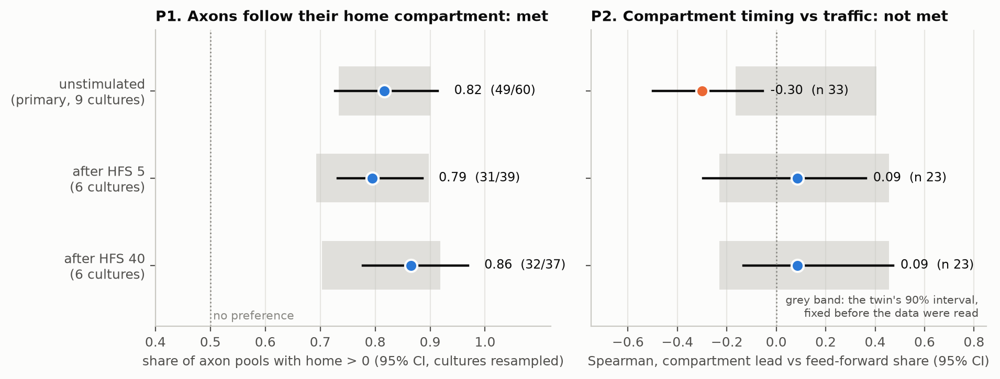

# Version 4 results: the chip twin on a four-compartment chip

Pre-registration `PREREGISTRATION_v4.md`, sha256 `6f7ac1d7887d3f53`, frozen and pushed (commit `07bc64c`) before any spike of the dataset was counted. Data: Lassers, Vakilna, Tang and Brewer (2023), Zenodo 10257483, CC0 1.0: hippocampal EC, DG, CA3 and CA1 grown in four compartments of one device on a 120-electrode array, 19 electrodes per compartment, five monitored tunnels per boundary with an electrode pair that gives each axon's direction. Scored by `scripts/evaluate_v4.py`; every number below is in `results/v4/results.json`.

## Primary outcomes (unstimulated recordings, 9 cultures)

| Outcome | Twin, fixed before scoring | Recorded | Verdict |
|---|---|---|---|
| P1. Share of axon pools whose spikes follow the compartment they grow from more closely than the one they grow into | 0.81; at least 0.73 at n = 60 | **0.82** (49/60; cultures resampled 0.73 to 0.91; sign test against 0.5 p = 4e-07) | **met** |
| P2. Spearman of the compartments' timing asymmetry (upstream leading) with the feed-forward share of axonal spikes | 0.12; inside [-0.16, 0.41] at n = 33 | **-0.30** (cultures resampled -0.50 to -0.05; permutation p = 0.09) | **not met**: below the interval |

## Secondary outcomes

| Condition | Boundaries / axon pools scored | P1 share | P2 Spearman | Spearman with axon share |
|---|---|---|---|---|
| unstimulated | 33 / 60 | 0.82 (at or above 0.73) | -0.30 (outside) | -0.27 (outside) |
| after HFS 5 | 23 / 39 | 0.79 (at or above 0.69) | 0.09 (inside) | 0.06 (inside) |
| after HFS 40 | 23 / 37 | 0.86 (at or above 0.70) | 0.09 (inside) | 0.01 (inside) |

Excluded boundaries (fewer than two counted axons): 3 of 36.

## Reading

* **P1 met, on all three conditions.** An axon's spikes follow its home compartment, which is how the twin wires a chip. The effect is far larger on the device than in the twin: the median home index is 0.24 recorded against 0.009 simulated. The twin's compartments are more tightly coupled to each other, relative to their own axons, than these are.
* **P2 not met.** The pre-registration read a result below the interval as: compartment timing runs against axonal traffic, which the twin has no mechanism for. On unstimulated cultures the compartment that leads tends to be the one receiving more traffic (Spearman -0.30), though the permutation test does not exclude zero (p = 0.09). After stimulation the relation is near zero and inside the interval (secondary).
* **What survives for chip design.** Neither the twin nor the device lets compartment timing stand in for the direction of axonal traffic: its relation with the measured direction is weak and, unstimulated, of the opposite sign. Direction has to be read from electrodes in the channels, which is the planner's advice. The twin's predicted relation fell outside its interval, and that is reported as a failed prediction.

Known mismatches, fixed in the pre-registration and not tuned: a loop of four compartments read one boundary at a time as two-chamber chips; tunnels 400 um against 500 um; cortical against hippocampal cultures; detection pipelines differ.
